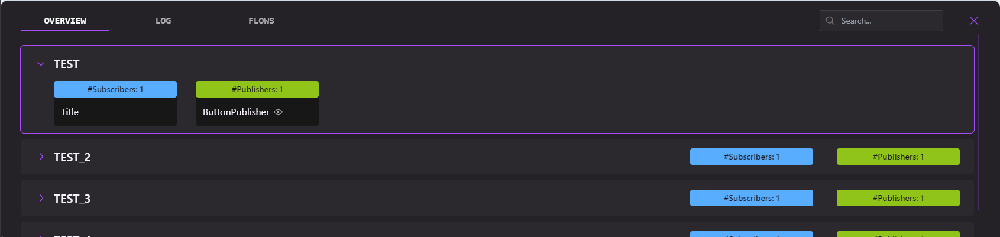
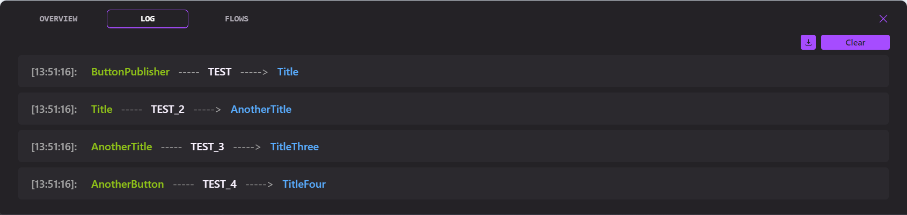
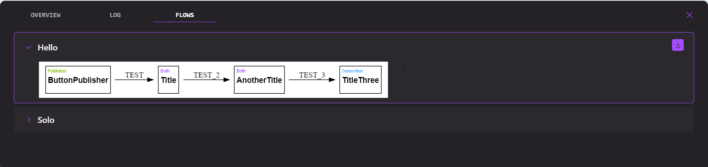

# Lucid Events

A library implementing a minimalistic event system for React in order to facilitate fire and forget style cross component communication while also providing a component, that is available during development, and allows to trace the events to increase maintainability and scalability of the event system.

## Installation

To install simply run:

```
npm install lucid-events
```

## Usage & Feature Explanation

### Creating Events
To create an event that receives a parameter, simply call the `createEvent` function:

```typescript
import { createSimpleEvent } from "lucid-events";

type TestShape = { test: string };

const { 2: useManageTest, 4: usePublishTest } = createEvent<TestShape>("TEST");
```

If the parameter is supposed to be optional, the type should contain f. ex. `undefined`:

```typescript
const { 2: useManageTest, 4: usePublishTest } = createEvent<TestShape | undefined>("TEST");
```

To create an event that never receives a parameter, use the `createSimpleEvent` function:

```typescript
import { createSimpleEvent } from "lucid-events";

const { 2: useManageSimple, 4: usePublishSimple } = createSimpleEvent("SIMPLE");
```

The return of both functions includes primitive sub and pub functions as well as specialized React hooks that can be used to concisely manage an event. `useManageTest` from the above example can be used to subscribe to an event in a component on mount and automatically unsubscribe when unmounting.

Again from the example above: `usePublishTest` is technically not necessary, since the simple pub function returned from the call to create an event can be used, but it is recommended, since it allows the association of a publish call to a component. In this way the log will not show `Unknown` when an event is fired. 

An example of its usage:
```typescript
const pub = usePublishTest("SomeComponent");
```

Here the pub function returned from the hook should be used, instead of the one returned from the create event call. This facilitates the association. This parameter can also be passed to the subscription hook.

The `EventTraceConsumer` component that is shown at the end of this section, allows highlighting of components if the configuration is set. To enable this for a publisher, do:

```typescript
const pub = usePublishTest("SomeComponent", "[data-event='SomeComponent']");
```

The parameter expects a CSS Selector, by which the component can be found and temporarily highlighted in the UI. This should help to understand which components in the UI fire a certain event (or which respond to one).


### EventTraceConsumer
To embed the component simply render it, preferably somewhere near the root, in your application.
```tsx
import { EventTraceConsumer } from "lucid-events";

ReactDOM.createRoot(document.getElementById("root") as HTMLElement).render(
	<React.StrictMode>
            // ... your app
            <EventTraceConsumer />
	</React.StrictMode>,
);
```
Below shows the different Tabs of the `EventTraceConsumer` component when it is embedded into the application and opened.

The overview tab is responsible for displaying the currently available events - determined by which of those have at least a subscriber or publisher. Depending on whether a subscriber/publisher is setup in that way, it is possible to temporarily highlight the component in the UI by clicking the eye icon. In the top right corner you can filter for specific events.



The Log Tab protocols every fired event with a timestamp. It keeps with the color coding before. Publishers in green and subscribers in blue. The fired event is displayed in the middle. If wanted the log can be exported as a `.txt` file when clicking on the download button.



The Flows Tab allows displaying certain event chains that have been correctly instrumentalized in the code. These graphs are SVGs and can be exported as well, in order to add them to a documentation.




### Enabling Flows

To enable flows to be displayed once executed, the code needs to be instrumentalized accordingly. For this there is the `Tracer` class which can be used to create Tracers. Tracers are tied to a single flow/process.

Here is an usage example:
```typescript
const hwTracer = Tracer.create("HelloWorld");
```

To signify that the publishing of a certain event initiates a flow, the code needs to be changed from:

```typescript
// Somewhere where the publish function is called
pub({test: "Hello World" })
```
to:

```typescript
// Somewhere where the publish function is called
hwTracer.init(() => pub({test: "Hello World" }));
```

It's important to **always return the result of the publish call to the callback of the tracer**. This allows the Tracer to assemble the trace correctly.

To show that a publishing of an event is a `step` of a flow, the step function instead of the `init` function has to be called:
```typescript
hwTracer.step(() => pub({test: "Hello World" }));
```

To signify that a pub call is a step of multiple Tracers, depending on which one is active, the `ts` function can be used:

```typescript
import { ts } from "lucid-events";

const anotherTracer = Tracer.create("Another One");

ts([hwTracer, anotherTracer]).step(() => pub({test: "Hello World" }));
```

This will only add the step to the tracer that is currently active.

**:warning:CAVEAT**

If both traces are active, the step will be added to both. There is no way to intrinsically differentiate between which one is the current call coming from. There is no way to enable a "maybe" scenario, in which pub is one time a part of one Tracer and another time the part of another Tracer, when both are active simultaneously. This could currently only be enabled by explicitly checking with an if statement when there is an externally available variable to safely differentiate which is the correct trace.

## Prod

During Prod the `EventTraceConsumer` is not rendered. It simply is an empty function returning `null`. The event system is also replaced by a simple copy that is stripped of everything that is not relevant to the functionality of the event system while still keeping the APIs intact as to not cause any issues.

